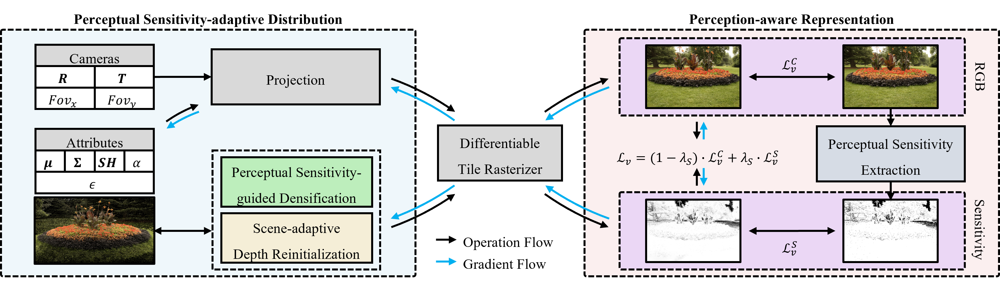

# Perceptual-GS: Scene-adaptive Perceptual Densification for Gaussian Splatting

#### Forty-second International Conference on Machine Learning, 2025

Hongbi Zhou<sup>1</sup>, [Zhangkai Ni](https://eezkni.github.io/)<sup>1</sup>

<sup>1</sup>Tongji University

This repository provides the official PyTorch implementation for the paper "Perceptual-GS: Scene-adaptive Perceptual Densification for Gaussian Splatting," ICML 2025. [Paper](https://arxiv.org/abs/2506.12400)



## About Perceptual-GS
3D Gaussian Splatting (3DGS) has emerged as a powerful technique for novel view synthesis. However, existing methods struggle to adaptively optimize the distribution of Gaussian primitives based on scene characteristics, making it challenging to balance reconstruction quality and efficiency. Inspired by human perception, we propose scene-adaptive perceptual densification for Gaussian Splatting (Perceptual-GS), a novel framework that integrates perceptual sensitivity into the 3DGS training process to address this challenge. We first introduce a perception-aware representation that models human visual sensitivity while constraining the number of Gaussian primitives. Building on this foundation, we develop a perceptual sensitivity-adaptive distribution to allocate finer Gaussian granularity to visually critical regions, enhancing reconstruction quality and robustness. Extensive evaluations on multiple datasets, including BungeeNeRF for large-scale scenes, demonstrate that Perceptual-GS achieves state-of-the-art performance in reconstruction quality, efficiency, and robustness.

## Environment setup
To start, we prefer creating the environment using conda:
```sh
conda create -n perceptual_gs python=3.7
conda activate perceptual_gs
pip install torch==1.12.1+cu116 torchvision==0.13.1+cu116 -f https://download.pytorch.org/whl/torch_stable.html
pip install -r requirements.txt
```

## Getting the data (We follow suggestions from [HAC](https://github.com/YihangChen-ee/HAC))

- The **Mip-NeRF 360** scenes are provided by the paper author [here](https://jonbarron.info/mipnerf360/). And we test on its entire 9 scenes ```bicycle, bonsai, counter, garden, kitchen, room, stump, flowers, treehill```. 

- The SfM datasets for **Tanks&Temples** and **Deep Blending** are hosted by 3D-Gaussian-Splatting [here](https://repo-sam.inria.fr/fungraph/3d-gaussian-splatting/datasets/input/tandt_db.zip). Download and uncompress them into the ```data/``` folder.

- The **BungeeNeRF** dataset is available in [Google Drive](https://drive.google.com/file/d/1nBLcf9Jrr6sdxKa1Hbd47IArQQ_X8lww/view?usp=sharing)/[百度网盘[提取码:4whv]](https://pan.baidu.com/s/1AUYUJojhhICSKO2JrmOnCA).

## Running the model
Before training, you should run `preprocess.py` to generate perceptual sensitivity maps:

```sh
python preprocess.py
```
Then, all scenes can be trained, rendered and evaluated through the following command:

```sh
python run.py
```

## Acknowledgments
This project is built upon [3DGS](https://github.com/graphdeco-inria/gaussian-splatting). Please follow the license of 3DGS. We thank all the authors for their great work and repos.


## Contact
Thanks for your attention! If you have any suggestion or question, feel free to leave a message here or contact Dr. Zhangkai Ni (eezkni@gmail.com).


## License
[MIT License](https://opensource.org/licenses/MIT)